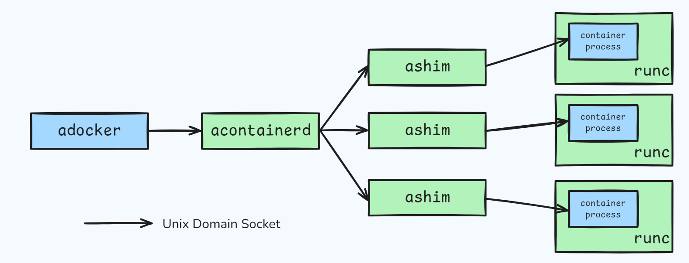

<div align="center">


**a customizable Docker developed during my time at Avaya**

<br>

[](./LICENSE)


[](https://github.com/yijun-l/docker/stargazers)

</div>

## Overview


This project is a simplified version of Docker, created as a hands-on exercise to learn about container technologies. The goal is to understand how containers work under the hood by building key features like process isolation, resource management, and container runtimes.  

It’s not meant for production but is a great way to explore and practice the concepts behind tools like Docker, such as namespaces, cgroups, and more.  

Have fun exploring!


## Architecture

This customizable Docker consists of the following components:  

- **`adocker`**: The client (CLI) that sends commands to manage containers.  
- **`acontainerd`**: A daemon process that receives messages from the CLI and coordinates container management.  
- **`ashim`**: A daemon process that interacts with `acontainerd` and manages specific containers.  
- **`runc`**: The process used to launch the actual container process.  



## Documentation

The documentation includes the following chapters:

- [01 - Overview](./doc/01%20-%20Overview.md)  
- [02 - Namespace](./doc/02%20-%20Namespace.md)  
- [03 - UTS Namespace](./doc/03%20-%20UTS%20Namespace.md)  
- [04 - User Namespace](./doc/04%20-%20User%20Namespace.md)  
- [05 - PID Namespace](./doc/05%20-%20PID%20Namespace.md)  
- [06 - Mount Namespace](./doc/06%20-%20Mount%20Namespace.md)  
- [07 - Minimal RootFS](./doc/07%20-%20Minimal%20RootFS.md)  
- [08 - OverlayFS](./doc/08%20-%20OverlayFS.md)  
- [09 - Net Namespace](./doc/09%20-%20Net%20Namespace.md)  
- [10 - IPC Namespace](./doc/10%20-%20IPC%20Namespace.md)  
- [11 - Cgroups Namespace](./doc/11%20-%20Cgroups%20Namespace.md)  
- [12 - Docker Architecture](./doc/12%20-%20Docker%20Architecture.md)  
- [13 - Daemon](./doc/13%20-%20Daemon.md)  
- [14 - Socket](./doc/14%20-%20Socket.md)  
- [15 - TTY](./doc/15%20-%20TTY.md)  

## Getting Started

This project can be run directly on **CentOS** or **RHEL** without needing any additional packages or dependencies.

1. Clone the repository:

    ```bash
    $ git clone git@github.com:yijun-l/docker.git
    $ cd docker
    ```

2. Build the project (daemon processes will be built and started automatically):
    ```bash
    $ make
    ```

3. Test with the client tool `adocker`:
    ```bash
    $ adocker help

    Usage: adocker [OPTION]...

    adocker is a client for interacting with the daemon through the CLI.

        help        display this help and exit
        version     output version information and exit
        connect     connect to a bash container
    ```

4. Clean up the project:

    ```bash
    $ make clean
    ```