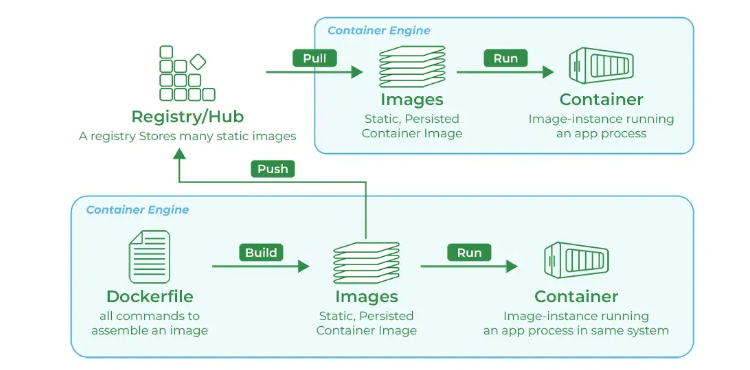

# Docker

**Docker** is a platform that allows developers to package applications into containers—lightweight, portable environments that bundle the application with all its dependencies. Containers ensure consistent performance and behavior across various systems, whether on a developer's laptop, a server, or in the cloud.


### Key components
- **Docker Engine**: The core service responsible for building, running, and managing containers.
- **Images**: Preconfigured templates used to create containers, built from Dockerfiles.
- **Containers**: Isolated environments where applications run, created from images.


## Deploy Docker Engine

Let's first install Docker Engine on CentOS 8 to get a feel for how Docker operates in practice.

```bash
# Set Up the Repository
sudo dnf -y install dnf-plugins-core
sudo dnf config-manager --add-repo https://download.docker.com/linux/centos/docker-ce.repo

# Install Docker
sudo dnf install docker-ce docker-ce-cli containerd.io docker-buildx-plugin docker-compose-plugin

# Start Docker
sudo systemctl enable --now docker

# Verify installation
sudo docker run hello-world
```

For more details, check the official docs: https://docs.docker.com/engine/install/centos/

## Basic Docker Commands

Next, we’ll explore some of the most commonly used Docker commands, giving you a hands-on understanding of how Docker works.



### Setting Up a Local Docker Registry

Docker images are typically pulled from Docker Hub, but you can also create your own registry for local use.

```bash
# Pull the "registry" image
docker pull registry

# Check the available images
docker images

# Run the Docker Registry container on port 5000
docker run -d -p 5000:5000 registry

# Make sure registry is running
docker ps
```
These commands will start a local Docker Registry service running on localhost:5000.

### Customizing a Docker Image

We’ll take the official Ubuntu image, install vim on it, and then create a new image.

```bash
# Run a container from the Ubuntu image
docker run -it ubuntu

# Since vim is not installed by default, update the package list and install it
apt update
apt install vim -y

# Commit the changes to create a new image (we’ll call it ubuntu-vim)
docker commit [container_id] ubuntu-vim
```
### Tagging and Pushing the Image to the Local Registry

Once our custom image created, we'll tag it and push it to our local Docker Registry.

```bash
# Tag the image with a version "v1"
docker tag ubuntu-vim localhost:5000/ubuntu-vim:v1

# Push the tagged image to the local registry
docker push localhost:5000/ubuntu-vim:v1

# Confirm the image is successfully uploaded
curl http://localhost:5000/v2/_catalog
```

### Cleaning Up Unused Images and Containers

To keep our Docker environment clean, we may want to remove unused images and containers.

```bash
# Remove all stopped containers
docker rm $(docker ps -a -q)

# Remove all unused images
docker rmi $(docker images -q)
```

### Running the Customized Image from the Local Registry

Finally, let’s run the customized image from our local registry.

```bash
# Pull and run the image from the local registry:
docker run -it localhost:5000/ubuntu-vim:v1
```

At this point, we’ll be running the custom ubuntu-vim image we pushed earlier, allowing us to use it with the vim editor installed.
