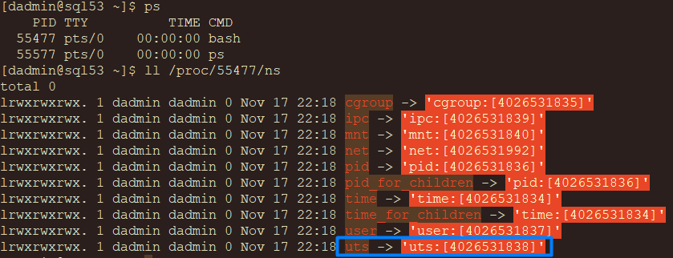
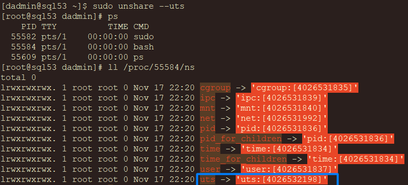

# Namespace

Docker is written in the Go programming language and takes advantage of several features of the Linux kernel to deliver its functionality. One of the key technologies Docker relies on is **namespaces**, which provide the isolated workspace that we call a container. When you run a container, Docker creates a set of namespaces for that container.

Namespaces offer a layer of isolation by partitioning kernel resources such that each partition is unique to a specific namespace. This isolation ensures that processes running within one namespace are unaware of and unable to directly interact with processes or resources in another namespace. Each aspect of a container runs in its own namespace, with access strictly limited to that namespace.


## Types of Namespaces

Namespaces were first introduced in the Linux kernel in 2002, beginning with the mount namespace. Over time, additional types of namespaces have been added, enabling the isolation of various system resources. Below are the most commonly used namespaces in Docker and Linux containerization:

### Mount Namespace (CLONE_NEWNS)

- Isolates file system mount points.
- Containers can have their own file system hierarchy, ensuring that changes to mounted file systems in one container don’t affect others.

### UTS Namespace (CLONE_NEWUTS)

- Isolates hostname and domain name.
- Containers can have their own hostname, enabling them to appear as separate machines on a network.

### PID Namespace (CLONE_NEWPID)

- Isolates process IDs.
- Processes within a container have their own PID numbering, starting from 1 for the container's init process.

### Network Namespace (CLONE_NEWNET)

- Isolates networking resources, such as IP addresses, routing tables, and sockets.
- Containers can have their own virtual network interfaces.

### IPC Namespace (CLONE_NEWIPC)

- Isolates inter-process communication (e.g., shared memory, message queues, and semaphores).

### User Namespace (CLONE_NEWUSER)

- Isolates user and group IDs.
- Enables mapping container users to different user IDs on the host, enhancing security.

### Cgroup Namespace (CLONE_NEWCGROUP)

- Isolates cgroup root directories.
- Ensures that resource limits and accounting are specific to a container.

By leveraging these namespaces, Docker achieves the isolation and independence that make containers lightweight and secure, with minimal impact on the host system or other containers.

# Unshare

The `unshare` command in Linux is a powerful utility for creating new namespaces for a process, separating it from the namespaces of its parent process. It provides a hands-on way to experiment with namespaces and understand their behavior.

The syntax for unshare is:

### Syntax

```
unshare [options] [program [arguments]]
```
The `unshare` command detaches the specified namespaces from the parent process and executes the given program within the new namespaces.
If no program is specified, the shell (`${SHELL}`, usually `/bin/sh`) is executed.

### Common unshare Options

- `--mount` or `-m`: Create a new mount namespace.
- `--uts` or `-u`: Create a new UTS namespace (isolating hostname and domain name).
- `--ipc` or `-i`: Create a new IPC namespace.
- `--pid` or `-p`: Create a new PID namespace.
- `--net` or `-n`: Create a new network namespace.
- `--user` or `-U`: Create a new user namespace.
- `--cgroup` or `-C`: Create a new cgroup namespace.

### Testing

The directory `/proc/[pid]/ns` in Linux provides a way to view and manage the namespaces associated with a specific process.

In the initial state, the Bash process runs in the global (default) namespaces.



After running `unshare --uts` command, a new UTS namespace is created for the process, isolating the hostname and domain name settings. The other namespaces remain shared with the global namespace.

