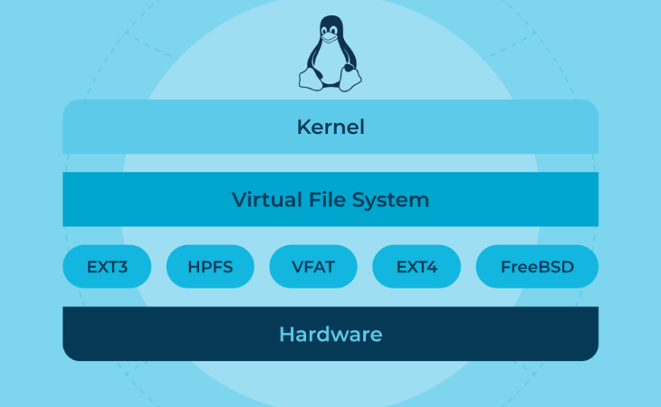

# Virtual File System

The **Virtual File System (VFS)** is a crucial part of the Linux kernel that provides a unified interface for programs to interact with different types of filesystems. It abstracts away the details of how data is stored on disk, allowing programs to work with files without worrying about the underlying storage mechanism. By using VFS, Linux can support various filesystems (like ext4, XFS, tmpfs, etc.) in a consistent way.



## Key Concepts in VFS

### Dentry (Directory Entry)

A **dentry** is an in-memory object that represents a file or a directory in the system. It connects the file name to the detailed information about that file, which is stored in the inode.

When a program tries to access a file using its path, the VFS checks the **dentry cache** to see if it can quickly find the file's details without needing to search the disk, improving performance.


### Inode (Index Node)

An **inode** is a data structure that holds important information about a file, such as its type (regular file, directory, etc.), size, permissions, and the location of the actual data blocks on disk. However, the inode doesn’t store the file’s name or its contents.

Each inode can be shared by multiple dentries, which allows for features like hard links, where multiple filenames point to the same file.

### File Object

A **file object** represents an open file and contains the state necessary for file operations. When a process opens a file, the kernel creates a file object, linking it to the inode and dentry. The file object also stores pointers to functions that handle reading, writing, and closing the file.

Each process has a **file descriptor table** that keeps track of open files. When the program performs file operations (like reading or writing), the file descriptor refers to the corresponding file object, which contains the necessary information to carry out the operation.

## How a Process Interacts with Files

The process of opening, reading, and writing to a file involves several steps in VFS:

### 1. Pathname Resolution:

When a process wants to open a file, it provides a pathname.

The VFS looks through the dentry cache to see if the dentry for the file already exists in memory. If not, it creates a new dentry and looks up the corresponding inode (metadata about the file).

### 2. Inode Lookup:

The VFS uses the parent folder's inode to help locate the inode of the file being requested.

Once the file's inode is found, the VFS gets all the important details about the file.

### 3. File Object Allocation:

The kernel allocates a file structure, which contains information about the file, like a reference to the **inode** and **dentry**, as well as function pointers for operations like `read()`, `write()`, and `close()`.

This file structure is placed in the process’s **file descriptor table**, which allows the process to interact with the file through its **file descriptor** (a number that represents the file).

### 4. System Call Execution:

When the process performs operations like `read()` or `write()`, it uses the file descriptor to retrieve the file structure. 

Once the process is done with the file, it calls `close()`, which removes the file structure from the **file descriptor table** and releases any resources associated with the file.

# Mount Namespace

A mount namespace provides a process with **its own set of mount points**, effectively isolating it from the global filesystem hierarchy.

- **Initial State**: When a new mount namespace is created, it starts with a copy of the parent namespace's mount points.
- **Independent Control**: Within this namespace, processes can independently add (mount) or remove (umount) mount points without affecting the parent or sibling namespaces.

This separation allows processes to work in isolated environments while interacting with their own specific mounts.

## Shared Subtrees

Initially, mount namespaces had limitations when making a filesystem change (like mounting a device) visible to multiple namespaces, each namespace required a separate operation.

To address the issues, shared subtrees were introduced.

**Shared subtrees** allow mount events to propagate across namespaces more flexibly, based on the propagation type of each mount point. Each mount point belongs to a peer group, which governs how events like mounting or unmounting are shared.

Propagation types include:

- `MS_SHARED`: Changes (like a new mount) propagate to all mount points in the peer group.
- `MS_PRIVATE`: No propagation occurs in either direction; changes are local.
- `MS_SLAVE`: Changes in the parent are received, but not shared outward.
- `MS_UNBINDABLE`: Similar to `MS_PRIVATE`, but these mount points cannot be used for bind mounts.

### Testing via unshare

```bash
### Parent Namespace 
$ mkdir /root/test
$ mount --bind /root/test /root/test
$ findmnt -o target,propagation test
TARGET     PROPAGATION
/root/test shared

### Child Namespace 
$ unshare --mount --fork --propagation unchanged
$ findmnt -o target,propagation test
TARGET     PROPAGATION
/root/test shared
$ umount /root/test
$ findmnt -o target,propagation test

### Parent Namespace 
$ findmnt -o target,propagation test
```
