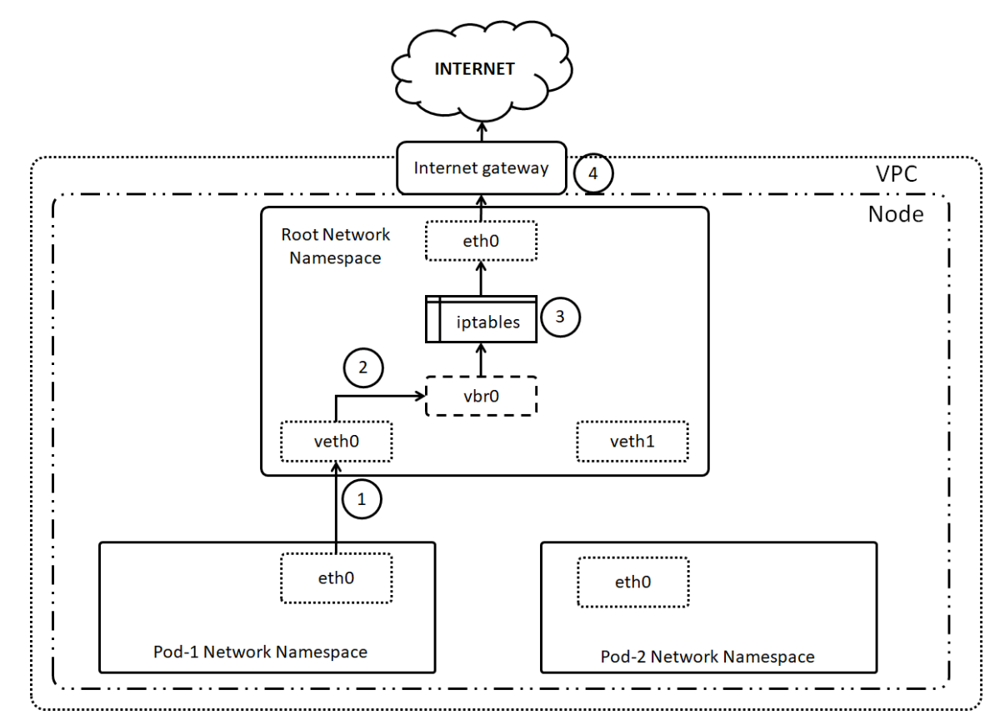
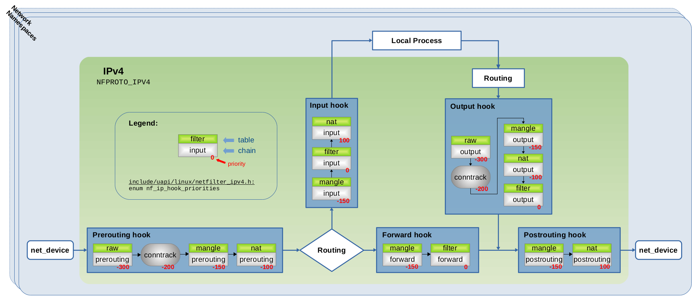

# Network Namespace

Typically, a Linux system shares a single set of networking resources, including network interfaces, routing tables, and firewall rules. With network namespaces, this assumption changes. 

A network namespace provides its own isolated instance of:

- **Network Interfaces**: Virtual or physical interfaces within the namespace.
- **Routing Tables**: Independent routing configurations.
- **Firewall Rules**: Separate Netfilter settings.
- **Other Networking Resources**: These include `/proc/net`, `/sys/class/net`, and even the UNIX domain socket namespace.

This means that processes within a namespace operate as though they are in their own independent networking environment.


## Virtual Ethernet (veth) and Bridge

To make network namespaces functional and useful, **virtual Ethernet (veth)** devices are often used as the primary mechanism for connecting namespaces to each other or to external networks. 

While bridges are commonly employed in these setups, they are **not strictly required** in all scenarios.

### Virtual Ethernet (veth)
A veth pair acts like a virtual cable with two endpoints. It is created as two interconnected interfaces: 

when one endpoint receives data, the other sends it, and vice versa.

```bash
## Create veth pair
$ ip link add [veth0] type veth peer name [veth1]

## Assign one end of veth to a namespace
$ ip link set [veth0] netns [ns]

# Bring up the interfaces
$ ip link set [veth0] up
$ ip netns exec [ns] ip link set [veth1] up

# Assign IP addresses
$ ip addr add 192.168.1.1/24 dev [veth0]
$ ip netns exec [ns] ip addr add 192.168.1.2/24 dev [veth1]
```

### Bridge

A bridge is a virtual Layer 2 (Ethernet) device that operates similarly to a physical switch. It connects multiple interfaces, allowing them to communicate as though they were on the same physical network. 

While bridges are useful for connecting multiple namespaces or devices, they are not mandatory if your setup requires only basic communication or direct access to a namespace's network interfaces.

```bash
# Create bridge device
$ ip link add name [br0] type bridge

# Add veth interfaces to the bridge
$ ip link set [veth0] master [br0]

## Check Bridge status
$ bridge link show
```

## Considerations on Netfilter

See a typical container network topology:



For inter-container or outbound traffic (via NAT), it passes through **Netfilter**.

In most cases, the packet flow goes through the **prerouting**, **forward**, and **postrouting** hooks.



<br>

## Testing

### Inter-container communication

```bash
# Create a veth pair
# veth0 will be used in the default namespace
# veth1 will be assigned to the ns1 namespace
$ ip link add veth0 type veth peer name veth1
$ ip addr add 2.2.2.1/30 dev veth0
$ ip link set veth0 up

# Create network namespace ns1 and assign veth1 to it
$ ip netns add ns1
$ ip link set veth1 netns ns1

# Run a bash shell in the ns1 namespace and configure veth1
$ setenforce 0
$ unshare --net=/var/run/netns/ns1
$ ip addr add 2.2.2.2/30 dev veth1
$ ip link set veth1 up

# Ping test from ns1
$ ping 2.2.2.1
PING 2.2.2.1 (2.2.2.1) 56(84) bytes of data.
64 bytes from 2.2.2.1: icmp_seq=1 ttl=64 time=0.190 ms
64 bytes from 2.2.2.1: icmp_seq=2 ttl=64 time=0.080 ms
64 bytes from 2.2.2.1: icmp_seq=3 ttl=64 time=0.077 ms

```
### Outbound Traffic via Bridge

```bash
# Create a bridge
$ ip link add name br0 type bridge
$ ip link set br0 up
$ ip link set veth0 master br0
$ ip addr del 2.2.2.1/30 dev veth0
$ ip addr add 2.2.2.1/30 dev br0

# Configure the default route in ns1
$ ip route add default via 2.2.2.1 dev veth1

# Capture ICMP echo traffic
$ tshark -i ens33 -f "host 2.2.2.2"
Running as user "root" and group "root". This could be dangerous.
Capturing on 'ens33'
    1 0.000000000      2.2.2.2 → 192.168.70.38 ICMP 98 Echo (ping) request  id=0x1f04, seq=1/256, ttl=63
    2 1.022211857      2.2.2.2 → 192.168.70.38 ICMP 98 Echo (ping) request  id=0x1f04, seq=2/512, ttl=63

# (option) The bridge forward is blocked by Netfilter, use one of the following methods to allow forwarding
$ sysctl -w net.bridge.bridge-nf-call-iptables=0
$ iptables -P FORWARD ACCEPT

# Configure NAT for outbound traffic
iptables -t nat -A POSTROUTING -s 2.2.2.0/30 -j SNAT --to-source 192.168.70.53

# Ping test works in ns1
$ ping 192.168.70.38
PING 192.168.70.38 (192.168.70.38) 56(84) bytes of data.
64 bytes from 192.168.70.38: icmp_seq=1 ttl=63 time=0.517 ms
```
