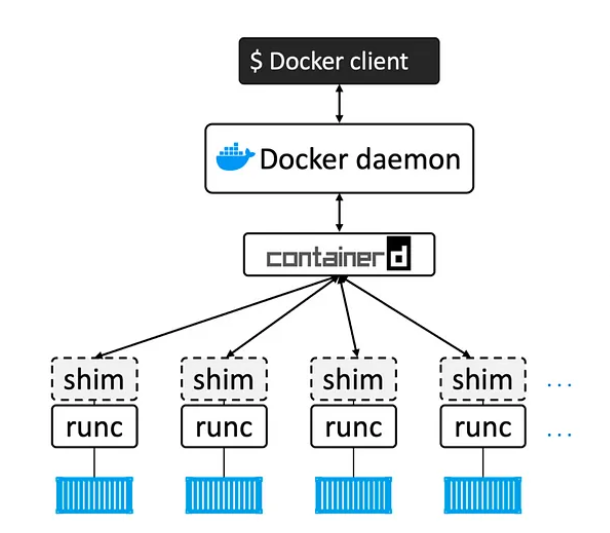

# Docker Architecture

In earlier sections, we explored core Linux features like **Namespace**, **UnifiedFS**, and **Cgroups**, and used them to create a basic container. 

While this helped us understand containerization, but it was closer to a simple **runc** rather than the full **docker**.


Docker’s architecture is designed as a layered system, following the Unix philosophy of simplicity and modularity. Each layer has a specific role, working together to provide a seamless and powerful containerization platform.



## 1. Docker Client (CLI)

The **Docker Client**, often referred to as the **Docker CLI**, is the primary interface through which users interact with Docker. It provides commands like `docker run`, `docker build`, and `docker pull`, which developers use to manage containers and images. 

When a user issues a command, the Docker Client translates it into an API request and sends it to the Docker Daemon. This user-friendly interface abstracts the complexity of container operations, making it easy for developers to work with containers without dealing with lower-level details.


## 2. Docker Daemon (dockerd)

The **Docker Daemon**, or **dockerd**, is the core service that manages the Docker containers and images on the system. It listens for requests from the Docker Client and coordinates tasks like container creation, image management, and network setup. 

In earlier versions, dockerd performed all the container management tasks, but over time it has been modularized to delegate lower-level tasks to specialized components like containerd and runc. This separation of concerns helps improve scalability, performance, and maintainability.


## 3. containerd

**containerd** is a key service that handles the container lifecycle at a high level. It is responsible for pulling and storing container images, creating and deleting containers, and overseeing container operations such as starting, stopping, and monitoring. 

As a bridge between the Docker Daemon (dockerd) and the container runtime, containerd ensures modularity and efficiency in the system. While dockerd delegates container management tasks to containerd, containerd itself delegates the actual execution and low-level container setup to runc, which interfaces with the Linux kernel to manage namespaces, cgroups, and other runtime requirements.


## 4. containerd-shim

The **containerd-shim** is an important component that ensures containers remain independent of higher layers like containerd and dockerd. 

Once a container is started, the shim process takes over and maintains the container’s execution. It keeps the container’s input/output streams open and ensures the container continues running even if containerd or dockerd is restarted. This allows for greater reliability and stability, ensuring containers are not disrupted by changes in the underlying system.

## 5. runc

**runc** is the low-level runtime that is responsible for creating and running containers on the system. It directly interacts with Linux kernel features such as namespaces and cgroups to configure the container's environment and resource limitations. 

As an implementation of the **Open Container Initiative (OCI)** standards, runc ensures that containers are compatible across different runtimes. After initializing a container and setting up the necessary environment, runc exits, transferring control to the containerd-shim, which allows the container to run independently.

<br>

## Testing

Initially, only two primary daemons are active: **dockerd** and **containerd**.

```bash
$ systemctl status docker
● docker.service - Docker Application Container Engine
   Loaded: loaded (/usr/lib/systemd/system/docker.service; enabled; vendor preset: disabled)
   Active: active (running) since Sun 2024-12-01 16:47:23 CST; 22h ago
     Docs: https://docs.docker.com
 Main PID: 1235 (dockerd)
    Tasks: 12
   Memory: 140.2M
   CGroup: /system.slice/docker.service
           └─1235 /usr/bin/dockerd -H fd:// --containerd=/run/containerd/containerd.sock


$ systemctl status containerd
● containerd.service - containerd container runtime
   Loaded: loaded (/usr/lib/systemd/system/containerd.service; disabled; vendor preset: disabled)
   Active: active (running) since Sun 2024-12-01 16:47:16 CST; 22h ago
     Docs: https://containerd.io
  Process: 917 ExecStartPre=/sbin/modprobe overlay (code=exited, status=0/SUCCESS)
 Main PID: 927 (containerd)
    Tasks: 8
   Memory: 68.2M
   CGroup: /system.slice/containerd.service
           └─927 /usr/bin/containerd
```

When a container starts, **containerd** launches a **shim** process and uses **runc** to set up the container. Once the container is running, **runc** exits, leaving the **shim** to manage it.

```bash
$ docker ps
CONTAINER ID   IMAGE     COMMAND   CREATED   STATUS    PORTS     NAMES

$ docker run -d registry
9ea169e04876cbacafa2f09ad2e96fd7426e45480de8b7bec370055c8ce811d3

$ docker ps
CONTAINER ID   IMAGE      COMMAND                  CREATED         STATUS         PORTS      NAMES
9ea169e04876   registry   "/entrypoint.sh /etc…"   4 seconds ago   Up 2 seconds   5000/tcp   blissful_shockley

$ ps -ef | grep shim
root        3399       1  0 14:56 ?        00:00:00 /usr/bin/containerd-shim-runc-v2 -namespace moby -id 9ea169e04876cbacafa2f09ad2e96fd7426e45480de8b7bec370055c8ce811d3 -address /run/containerd/containerd.sock

$ ps -ef | grep 3399
root        3399       1  0 14:56 ?        00:00:00 /usr/bin/containerd-shim-runc-v2 -namespace moby -id 9ea169e04876cbacafa2f09ad2e96fd7426e45480de8b7bec370055c8ce811d3 -address /run/containerd/containerd.sock
root        3421    3399  0 14:56 ?        00:00:00 registry serve /etc/docker/registry/config.yml

```

When another container is started, a new **shim** process is created for the new container.

```bash
$ docker run -d registry
e9de1108863fdb4c280e90413234d0e1e1a02cd6eb28c453059fad74d00940b8

$ docker ps
CONTAINER ID   IMAGE      COMMAND                  CREATED         STATUS         PORTS      NAMES
e9de1108863f   registry   "/entrypoint.sh /etc…"   7 seconds ago   Up 6 seconds   5000/tcp   loving_ramanujan
9ea169e04876   registry   "/entrypoint.sh /etc…"   5 minutes ago   Up 5 minutes   5000/tcp   blissful_shockley

$ ps -ef | grep shim
root        3399       1  0 14:56 ?        00:00:00 /usr/bin/containerd-shim-runc-v2 -namespace moby -id 9ea169e04876cbacafa2f09ad2e96fd7426e45480de8b7bec370055c8ce811d3 -address /run/containerd/containerd.sock
root        3491       1  0 15:02 ?        00:00:00 /usr/bin/containerd-shim-runc-v2 -namespace moby -id e9de1108863fdb4c280e90413234d0e1e1a02cd6eb28c453059fad74d00940b8 -address /run/containerd/containerd.sock
```