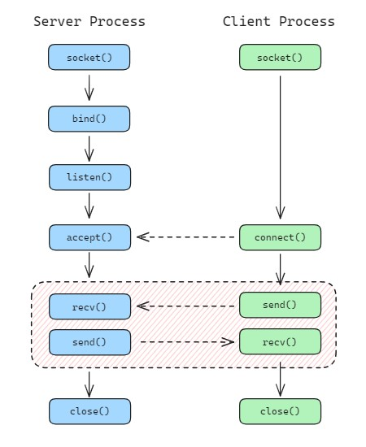

# Socket

A socket is like a connection point that allows programs to talk to each other. There are two main types: 
- **Internet domain sockets**: are used for communication between programs on different machines over a network
- **UNIX domain sockets**: are meant for communication between programs running on the same machine.

The typical use case for sockets is the **client-server model**, where a client communicates with a server over a network or locally.



## Socket system calls

Here is a list of common Linux socket functions:

- `socket()`: Creates a new socket.
- `bind()`: Binds a socket to an address and port.
- `listen()`: Prepares a socket to listen for incoming connections (server-side).
- `accept()`: Accepts an incoming connection on a listening socket (server-side).
- `connect()`: Initiates a connection to a remote server (client-side).
- `send()`: Sends data through a socket.
- `recv()`: Receives data from a socket.
- `close()`: Closes a socket.
- `setsockopt()`: Sets options for a socket (e.g., buffer size, timeouts).
- `getsockopt()`: Retrieves socket options.

<br>

# Epoll

In Linux, **epoll** is an event notification mechanism that allows an application to efficiently monitor multiple file descriptors to determine if I/O operations can be performed.

The file descriptors monitored by epoll can operate in either **Level-Triggered** (default) or **Edge-Triggered** mode.

- **Level-Triggered (LT)**: The file descriptor triggers an event as long as the event condition is true. If the condition persists after the event is processed, the file descriptor will continue to trigger events.
- **Edge-Triggered (ET)**: The file descriptor triggers an event only when its status changes (i.e., when the condition transitions from false to true).

When building a server with epoll, it's recommended to set the file descriptors to non-blocking mode (using the `O_NONBLOCK` flag) and enable Edge-Triggered mode (using the `EPOLLET` flag). I/O event handling should be completed only after `read()` or `write()` returns `EAGAIN`, indicating that the operation should be retried later.

## Epoll system calls


The following system calls are provided to create and manage an **epoll** instance:

- `epoll_create()`: Creates a new epoll instance.
- `epoll_ctl()`: Adds, modifies, or removes file descriptors from the epoll instance.
- `epoll_wait()`: Waits for events on the file descriptors being monitored by the epoll instance.

<br>

# Sockets in Docker

The Docker architecture heavily relies on **Unix domain sockets** for efficient and secure inter-process communication. 

Key components such as the **Docker daemon (dockerd)**, **Docker CLI**, **containerd**, and **containerd-shim** use Unix domain sockets to interact seamlessly, making them a fundamental part of Docker's design.

 ## 1. Communication Between Docker CLI and Docker Daemon

 The **Docker CLI (docker)** communicates with the **Docker daemon (dockerd)** using a Unix domain socket located at `/var/run/docker.sock`. 
 
 This communication is based on the REST API, allowing the CLI to send requests such as creating containers, managing networks, and retrieving logs.

 ```bash
$ ss -lnp | grep dockerd
u_str LISTEN 0      2048                                                         /var/run/docker/metrics.sock 27417                  * 0      users:(("dockerd",pid=1235,fd=3))              
u_str LISTEN 0      2048                                         /var/run/docker/libnetwork/5665c1303d68.sock 29030                  * 0      users:(("dockerd",pid=1235,fd=19))             
u_str LISTEN 0      128                                                                      /run/docker.sock 22476                  * 0      users:(("dockerd",pid=1235,fd=9),("systemd",pid=1,fd=76))

$ curl --unix-socket /run/docker.sock http://localhost/version
{"Platform":{"Name":"Docker Engine - Community"},"Components":[{"Name":"Engine","Version":"26.1.3","Details":{"ApiVersion":"1.45","Arch":"amd64","BuildTime":"2024-05-16T08:33:34.000000000+00:00","Experimental":"false","GitCommit":"8e96db1","GoVersion":"go1.21.10","KernelVersion":"4.18.0-553.6.1.el8.x86_64","MinAPIVersion":"1.24","Os":"linux"}},{"Name":"containerd","Version":"1.6.32","Details":{"GitCommit":"8b3b7ca2e5ce38e8f31a34f35b2b68ceb8470d89"}},{"Name":"runc","Version":"1.1.12","Details":{"GitCommit":"v1.1.12-0-g51d5e94"}},{"Name":"docker-init","Version":"0.19.0","Details":{"GitCommit":"de40ad0"}}],"Version":"26.1.3","ApiVersion":"1.45","MinAPIVersion":"1.24","GitCommit":"8e96db1","GoVersion":"go1.21.10","Os":"linux","Arch":"amd64","KernelVersion":"4.18.0-553.6.1.el8.x86_64","BuildTime":"2024-05-16T08:33:34.000000000+00:00"}
 ```

## 2. Communication Between Docker Daemon and containerd

The **Docker daemon** delegates container lifecycle management and low-level tasks to **containerd**. 

This communication also uses a Unix domain socket, typically located at `/run/containerd/containerd.sock`, and follows the gRPC protocol.

```bash
$ ss -lnp | grep \"containerd\"
u_str LISTEN 0      128                                                 /run/containerd/containerd.sock.ttrpc 25227                  * 0      users:(("containerd",pid=927,fd=8))            
u_str LISTEN 0      128                                                       /run/containerd/containerd.sock 25236                  * 0      users:(("containerd",pid=927,fd=9))           

$ ctr --address /run/containerd/containerd.sock version
Client:
  Version:  1.6.32
  Revision: 8b3b7ca2e5ce38e8f31a34f35b2b68ceb8470d89
  Go version: go1.21.10

Server:
  Version:  1.6.32
  Revision: 8b3b7ca2e5ce38e8f31a34f35b2b68ceb8470d89
  UUID: 5d866b39-0962-40b0-845b-1de08d5a1609
```

## 3. Communication Between containerd and containerd-shim

To manage individual containers, **containerd** relies on a **shim process (containerd-shim)**. The **shim** acts as an intermediary between **containerd** and the container runtime (e.g., runc). 

This design ensures that:

- Containers remain running even if **containerd** or **dockerd** crashes.
- Each container has its own isolated management process, improving reliability and debugging.

Each **shim** instance communicates with **containerd** through its own Unix domain socket, typically located under `/run/containerd/s/`. The **shim** invokes the container runtime to launch and manage container processes, ensuring efficient and isolated operation.

```bash
$ docker ps
CONTAINER ID   IMAGE      COMMAND                  CREATED       STATUS      PORTS      NAMES
e9de1108863f   registry   "/entrypoint.sh /etc…"   8 days ago    Up 8 days   5000/tcp   loving_ramanujan
9ea169e04876   registry   "/entrypoint.sh /etc…"   8 days ago    Up 8 days   5000/tcp   blissful_shockley
3a1b411b6297   ubuntu     "/bin/bash"              2 weeks ago   Up 5 days              objective_mahavira

$ ss -lnp | grep shim
u_str LISTEN 0      2048   /run/containerd/s/02af3ce0b72eab9671e80d78d7598f1ff6a7d638cdd4cca8ea987e59ff27b892 653863                 * 0      users:(("containerd-shim",pid=6313,fd=11))     
u_str LISTEN 0      2048   /run/containerd/s/9eb7f9d34a03a9c6ca3fbe4e2c17b3e5e0181a7b11bd767d3803675ea2ec559d 188997                 * 0      users:(("containerd-shim",pid=3491,fd=11))     
u_str LISTEN 0      2048   /run/containerd/s/5d548dcef22833ba543b68a9e041e2bc725150c0af6a173e2e49e574b57297dd 188044                 * 0      users:(("containerd-shim",pid=3399,fd=11))  
```