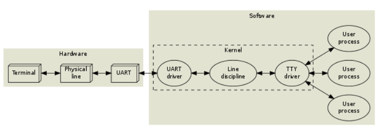
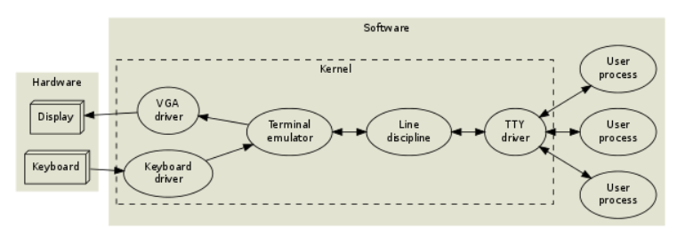
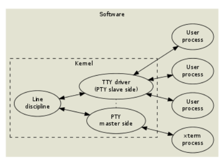

# TTY

The term **TTY** stands for **teletypewriter**, originating from the early days of computing when physical teletype machines were used to interact with computers.


<br>

In modern Linux systems, **TTY** refers to virtual terminals, which provide users with an interface to send commands to and receive output from the operating system.

## Types of Terminals

Linux provides three main types of terminals:

### 1. Physical Terminals

These are hardware devices connected via serial ports, often used in embedded systems or for remote debugging.

For example, `/dev/ttyS0` refers to a serial terminal device.



### 2. Virtual Terminals (VTs)

These are text-based terminals managed by the Linux kernel. Virtual terminals emulate traditional hardware terminals and provide a text interface to the system. You can switch between them using **Ctrl + Alt + Fn** keys. They are commonly used for system recovery or when the graphical interface is unavailable.

For example, `/dev/tty0` represents the virtual terminal.



### 3. Pseudo-Terminals (PTYs)

These are virtual devices that facilitate communication between applications simulating terminal behavior and processes running in them. A PTY is implemented as a master-slave pair:

- The **master device** (e.g., `/dev/ptmx`) interacts with a terminal emulator application, such as an SSH client or xterm.
- The **slave device** (e.g., `/dev/pts/0`) provides a standard terminal interface to the processes running in the emulated environment.



## Line Discipline

**Line discipline** is a key component of the Linux TTY (terminal) subsystem, responsible for managing terminal input and output. 

It acts as an intermediary layer between the application and the underlying hardware driver, providing crucial functionalities for data processing, editing, and control.

### Why need it

In early systems, a **terminal (physical teletype)** connected via a **UART (Universal Asynchronous Receiver and Transmitter)** would send raw bytes to an application. However, this basic model lacked essential features such as line editing, session management, and input/output control. 

To address these limitations, the operating system introduced line discipline, a software layer that sits between the UART driver and the application, enhancing the interaction and enabling more sophisticated terminal behavior.

### Key Features

#### Data Editing and Processing

Line discipline provides basic line-editing features, including backspace, character deletion, and line clearing. These functions are typically enabled in **cooked mode** (also known as **canonical mode**), which allows users to correct mistakes before sending input to the application. 

In contrast, modern applications, such as text editors and shells, often switch to **raw mode**, where line discipline no longer handles editing. In this mode, the application itself manages input processing.

#### Session Management

In a multi-tasking environment, line discipline manages user input by ensuring that it is directed only to the foreground program. If a background process attempts to write to the terminal, line discipline pauses it to avoid conflicts. 

Additionally, if a process enters an infinite loop, users can rely on line discipline to interrupt or suspend the process, providing greater control over system interactions.

#### Terminal Driver Interface

Line discipline interacts with the underlying TTY driver to handle character input and output, manage buffering, and control terminal device states. 

For instance, it can pause or resume data transmission based on the terminal's current state, helping to maintain a smooth flow of data between the user and the application.

# TTY in docker

When we start a container with interactive options (e.g., `-i` or `-t`), Docker sets up a **pseudo-terminal (PTY)** to enable seamless communication between the host terminal and the container's process.

This mechanism is particularly useful for running interactive applications, such as `bash`, where users expect real-time input/output behavior.

## TTY behavior in bash container

Let’s demonstrate how TTYs behave by starting a bash container interactively. 

In the following scenario, the commands run in `/dev/pts/0`, but the output is displayed in `/dev/pts/1`.

```bash
$ tty
/dev/pts/1

$ docker ps
CONTAINER ID   IMAGE      COMMAND                  CREATED       STATUS             PORTS      NAMES
3a1b411b6297   ubuntu     "/bin/bash"              4 weeks ago   Up About an hour              objective_mahavira

$ docker attach 3a1b411b6297

3a1b411b6297:/$ tty
/dev/pts/0
```

## How Docker connects TTYs

The Docker client process (e.g., `docker attach`) communicates with the Docker daemon (`dockerd`) using a Unix domain socket, located at `/run/docker.sock`.

```bash
$ ps -ef | grep 'docker attach'
root        3479    3276  0 09:48 pts/1    00:00:00 docker attach 3a1b411b6297

$  ll /proc/3479/fd
total 0
lrwx------. 1 root root 64 Dec 25 12:28 0 -> /dev/pts/1
lrwx------. 1 root root 64 Dec 25 12:28 1 -> /dev/pts/1
lrwx------. 1 root root 64 Dec 25 12:28 2 -> /dev/pts/1
lrwx------. 1 root root 64 Dec 25 12:28 3 -> 'socket:[140978]'
lrwx------. 1 root root 64 Dec 25 12:28 4 -> 'anon_inode:[eventpoll]'
lr-x------. 1 root root 64 Dec 25 12:28 5 -> 'pipe:[140977]'
l-wx------. 1 root root 64 Dec 25 12:28 6 -> 'pipe:[140977]'
lrwx------. 1 root root 64 Dec 25 12:28 7 -> 'socket:[140981]'
lrwx------. 1 root root 64 Dec 25 12:28 8 -> 'socket:[140984]'

$ ss -np | grep 140978
u_str ESTAB  0      0                                                                                       * 140978              * 140979 users:(("docker",pid=3479,fd=3))
u_str ESTAB  0      0                                                                        /run/docker.sock 140979              * 140978 users:(("dockerd",pid=1286,fd=25))
```

The Docker daemon (`dockerd`) forwards the messages to the container runtime `shim` via `containerd`.

```bash
$ ps -ef | grep shim
root        2779       1  0 08:47 ?        00:00:08 /usr/bin/containerd-shim-runc-v2 -namespace moby -id 3a1b411b62978fd8c81f629dfa3698bda5154c3d29c48294c65d5128dd452d36 -address /run/containerd/containerd.sock

$ ps -ef | grep 2779
root        2779       1  0 08:47 ?        00:00:08 /usr/bin/containerd-shim-runc-v2 -namespace moby -id 3a1b411b62978fd8c81f629dfa3698bda5154c3d29c48294c65d5128dd452d36 -address /run/containerd/containerd.sock
root        2799    2779  0 08:47 pts/0    00:00:00 /bin/bash
```

The `shim` process holds the master end of the PTY (located at `/dev/pts/ptmx`), while the container’s `bash` process holds the slave end (e.g., `/dev/pts/0`).

```bash
$ ll /proc/2779/fd
lrwx------. 1 root root 64 Dec 25 08:48 16 -> /dev/pts/ptmx

$ ll /proc/2799/fd
total 0
lrwx------. 1 root root 64 Dec 25 08:47 0 -> /dev/pts/0
lrwx------. 1 root root 64 Dec 25 08:47 1 -> /dev/pts/0
lrwx------. 1 root root 64 Dec 25 08:47 2 -> /dev/pts/0
```

## Namespace isolation of TTYs

TTYs in the host namespace and the container are isolated due to the use of the MOUNT namespace. 

Even though they share the same path (`/dev/pts/0`), they are distinct, as evidenced by their differing device IDs:

```bash
$ stat --format='%N %d' /dev/pts/0
'/dev/pts/0' 23

3a1b411b6297:/$ stat --format='%N %d' /dev/pts/0
'/dev/pts/0' 64
```

## TTY Flow in a Bash Container

To summarize, the TTY message flow in a bash container operates as follows:

1. **User Input**: Commands are entered in the host terminal (`/dev/pts/1`), which serves as the interface for user interactions.
2. **Docker Client**: The `docker attach` process relays input/output between the terminal and the Docker daemon (`dockerd`) via a Unix domain socket (`/run/docker.sock`).
3. **Docker Daemon**: The daemon forwards the communication to the container runtime (`containerd`) for handling container processes.
4. **Container Runtime**: The runtime sets up a PTY and manages the connection through the `shim` process, which holds the master end of the PTY (`/dev/pts/ptmx`).
5. **Container Process**: The `bash` process in the container receives input and sends output via the slave end of the PTY (`/dev/pts/0`).